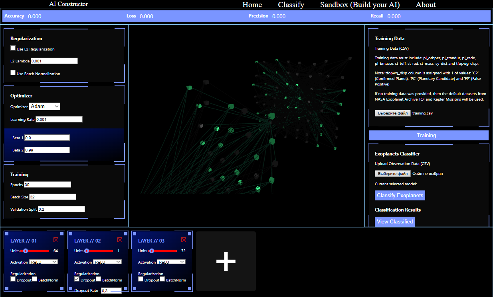
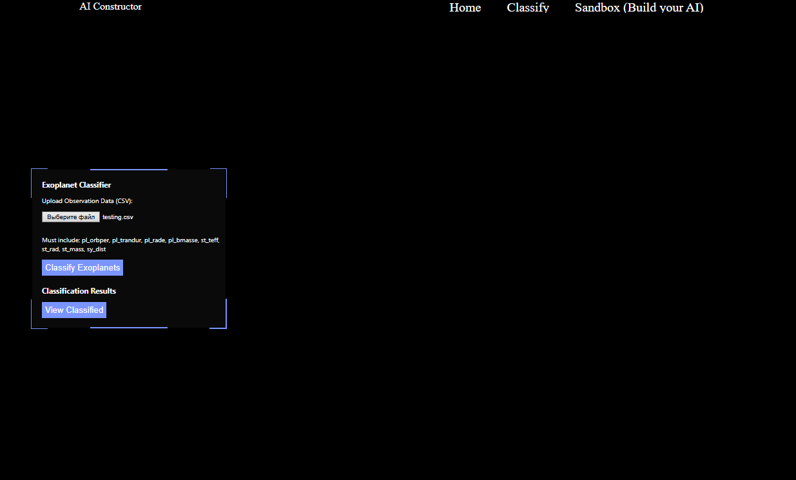

# AI-Constructor


## Overview

Django web application built with Redis, Celery and Tensorflow. You can create new neural network model, train it and use it. You can also compare multiple these models according to metrics.

AI Constructor was made in thought for NASA Space Apps Challenge 2025. Therefore it was made specifically for the classificaion of exoplanets from TOI and Cumulative (pscomppars) datasets.

# Training data

Neural network models use for training and classification the .csv format.

Training data must include: pl_orbper, pl_trandur, pl_rade, pl_bmasse, st_teff, st_rad, st_mass, sy_dist and tfopwg_disp.

Note: tfopwg_disp column is assigned with 1 of values: 'CP' (Confirmed Planet), 'PC' (Planetary Candidate) and 'FP' (False Positive)


If no training data was provided, then the default datasets from NASA Exoplanet Archive TOI and Kepler Missions will be used.
					

### AI Constructor


You can set hyperparameters, amount of layers, types of layers and etc.
Then you can train the model and view the metrics above. You can view more by clicking the metrics above.
You can also use your created model to classify data.

Your trained model is saved into database. Therefore you can edit your model and train it again and then compare it with your previous one.

### Use in-built Neural Network model for classification


## Quickstart

- Clone the repository
  ```shell
  git clone https://github.com/EliasLucky/AI-Constructor.git
  cd AI-Constructor
  ```
- Setup and run the Docker container
  ```shell
  docker compose up
  ```

### How to create datasets?

Github repository includes pre-made files `training.csv` and `testing.csv` using NASA Exoplanets Archive database.

In addition you can view [training.py](./training.py) file and run the appropriate function you need.
- `traing_and_save_model()` To create and train basic neural network model and save it as `exoplanet_model.h5` with scaler `scaler.pk1`. The `training.csv` is generated for training but not saved.
- `new_csv()` To generate `training.csv` and `testing.csv`

## Central packages

- *Django* is used as a backend and management interface to host Celery tasks.
- *celery* is used for task workers to train and use neural network models asynchronously.
- *redis* passess celery task workers back and forth.
- *tensorflow* is used a machine learning framework.
- *scikit-learn* is used for data analysis.

## Contribution

## Can I contribute?

Yes! If you are a coder feel free to *Fork* the repository and send your amazing Pull Requests!

## How should I contribute?

Python PEP-8 code style guidelines.
JavaScript Modern ES6+ Syntax.
